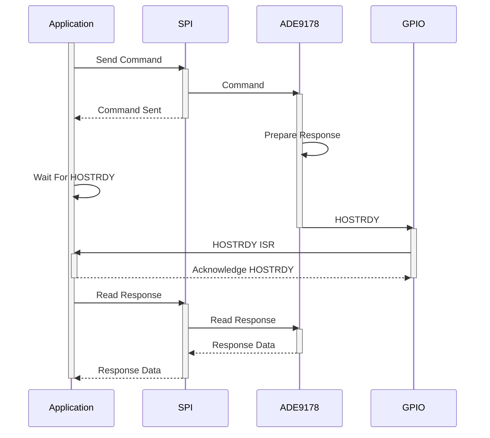

# ADE9178 Registers

## Table of Contents

- [Introduction](#introduction)
- [Example](#example)
  - [Hardware Setup and Connections](#hardware-setup-and-connections)
  - [Building, Running, and Debugging Examples](#building-running-and-debugging-examples)
  - [Board Support Functions](#board-support-functions)
- [References](#references)

## Introduction

This folder contains the register definitions and example code required to communicate with the ADE9178 IC. Header files are located in the [include](include) directory. ADI also provides a [MetIC service](https://github.com/analogdevicesinc/energy-ade9178-example.git) with higher levels of abstraction and a CLI example. It is recommended to use that for quick evaluation and development, and use direct register access for finer control.

The ADE9178 uses a command and response protocol over SPI for communication with host devices. The command format is given in the `ADI_ADE9178_CMD` structure. The following structures are defined to extract various responses from ADE9178 easily:

- `ADI_ADE9178_RESPONSE`
- `ADI_ADE9178_1x2xADC_RESPONSE`
- `ADI_ADE9178_3x4xADC_RESPONSE`
- `ADI_ADE9178_ERROR_RESPONSE`

Use the following configuration to communicate with the ADE9178:

- **SPI**
  - Mode: 3 (CPOL = 1, CPHA = 1)
  - Speed: > 6 MHz
- **GPIOs**
  - 2 inputs for ADE9178 protocol: [`HOST_RDY`, `HOST_ERR`] - Active Low
  - 4 inputs for interrupt handling: [`IRQ0`, `IRQ1`, `IRQ2`, `IRQ3`] - Active Low
  - 1 output to reset the ADCs and ADE9178 - Active Low

The following diagram shows the sequence of events while communicating with the ADE9178:

## Example

The example provided demonstrates basic communication with the [ADE9178 IC](https://www.analog.com/en/products/ade9178.html) using the [ADE9178 Evaluation Board](https://www.analog.com/en/resources/evaluation-hardware-and-software/evaluation-boards-kits/eval-ade9178.html).

- Initializes the evaluation board by setting up peripherals and performing a board reset.
- Enables reading from and writing to ADE9178 registers.
- Supports reading from and writing to ADE911x and ADE910x devices.

### Hardware Setup and Connections

Refer to the [ADE9178 Evaluation Board Readme](https://www.analog.com/en/resources/evaluation-hardware-and-software/evaluation-boards-kits/eval-ade9178.html) for detailed hardware setup and connection instructions.

### Building, Running, and Debugging Examples

The output of the example is displayed on the serial console connected to the COM port of the board.

Refer to the [Board Readme](https://github.com/analogdevicesinc/energy-board-support/blob/main/max/eval_ade9178/README.md) for detailed steps on building, running, and debugging the example.

### Board Support Functions

The following functions from the [board_support repo](https://github.com/analogdevicesinc/energy-board-support/tree/main/generic/include) are used in this example. If you are porting to a different platform, you must implement these functions:

- `EvbInit`
- `EvbInitMessageBuffer`
- `EvbResetAde`
- `EvbAdeSpiTransmitAsync`
- `EvbAdeSpiReceiveAsync`
- `EvbEnableAllGPIOIrq`
- `EvbGetPinState`
- `EvbFlushMessages`

## References

- [ADE9178 Product Page](https://www.analog.com/en/products/ade9178.html)
- [ADE9178 Datasheet (PDF)](https://www.analog.com/media/en/technical-documentation/data-sheets/ade9178.pdf)
- [ADE9178 Evaluation Board](https://www.analog.com/en/resources/evaluation-hardware-and-software/evaluation-boards-kits/eval-ade9178.html)
- [MAX32670 SDK](https://github.com/analogdevicesinc/msdk/tree/v2024_10)